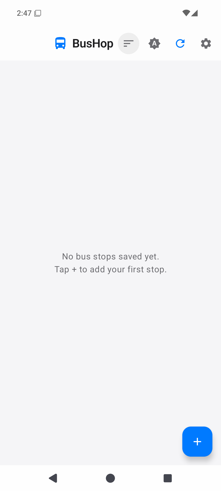
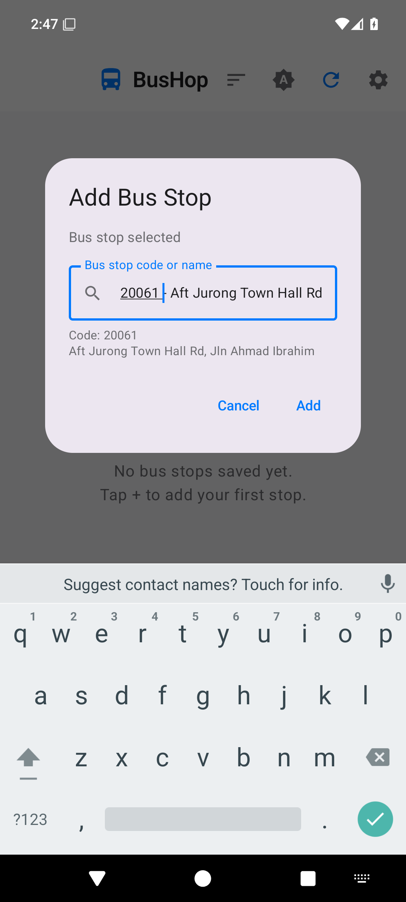

<div align="center">
  
  <h1>BusHop</h1>
  <p><strong>Lightweight Singapore bus timing app</strong></p>
  <p>Material 3 Compose UI with real-time arrivals, drag-to-reorder, pinning, and smart search. No ads, no accounts, no tracking.</p>
  <p>
    
    
    
    
    
    
  </p>
</div>

---

## Screenshots

| Main Screen                                          | Expanded Stop Cards                                        | Search & Add                                             |
| ---------------------------------------------------- | ---------------------------------------------------------- | -------------------------------------------------------- |
| _Bus stop list with arrivals, pinned stops at top_   | _Expanded stop with all services and timings_              | _Type-stop search with instant TokenTrie O(k) matching_  |
|  |  |  |

## Features

|     | Feature                  | Detail                                                                                           |
| --- | ------------------------ | ------------------------------------------------------------------------------------------------ |
| 🚌  | **Real-time arrivals**   | Shows next 3 buses per service with minutes-to-arrival                                           |
| 🏷️  | **Operator badges**      | SBS, SMRT, TTS, Go-Ahead colour-coded                                                            |
| 🚍  | **Bus type icons**       | Single Decker, Double Decker, Bendy                                                              |
| 💺  | **Load indicator**       | Seats Available / Standing Available / Limited Standing                                          |
| ♿  | **Wheelchair info**      | Wheelchair Accessible Bus (WAB) indicator                                                        |
| 📌  | **Pin stops & services** | Pin stops to the top; pin individual bus services within a stop                                  |
| 🔍  | **Smart search**         | TokenTrie O(k) prefix search + Levenshtein fuzzy matching over 5,201 stops — instant, no network |
| 📍  | **Nearby stops**         | Location-based nearby stop finder (opt-in)                                                       |
| 💡  | **Random hints**         | Truly random bus stop hint shown every time you open the search dialog (from all 5,201 stops)    |
| 🌙  | **Theme support**        | Light, Dark, System-following, with Blue and Contrast Blue colour schemes — all persisted        |
| 🔄  | **Auto-refresh**         | Configurable interval (30s / 1m / 2m / 5m / Off) — pauses in background                          |
| ↘️  | **Pull to refresh**      | Swipe down to refresh all stops                                                                  |
| 🖱️  | **Drag to reorder**      | Long-press and drag bus stops to reorder — commit on drag end                                    |
| 🗑️  | **Drag to delete**       | Drag a stop into the bottom delete zone — card-center-in-zone threshold                          |
| 🔒  | **Privacy first**        | Location is opt-in only. No accounts, no analytics, no telemetry                                 |
| 📱  | **Material 3**           | Modern Compose UI with animations, pull-to-refresh, edge-to-edge                                 |

## Download

> **Latest release:** [v1.0.0](https://github.com/B67687/BusHop/releases/latest) — `bus-hop.apk` (**1.75 MB**, R8-minified, shrinkResources, signed)

Or [build from source](#build-from-source) for a debug APK.

## Architecture



- **domain/** — Pure Kotlin (zero framework deps). Models, use cases, repository interfaces.
- **data/** — Android library. Retrofit API calls, DataStore persistence, BusStopIndex with TokenTrie for search.
- **app/** — Android app. Jetpack Compose UI, ViewModels, theme, components.

## Pipeline



1. **Development** — Code written iteratively by AI agent + human review. Source, tests, and config live in `main`.
2. **CI** — Every push triggers linting, 154+ unit tests, and architecture boundary checks via GitHub Actions.
3. **Build** — Gradle compiles Kotlin, R8 minifies + optimizes + `shrinkResources` reduces the release APK down to ~1.75 MB (vs 18 MB debug).
4. **Release** — APK is signed, published as a GitHub Release, and distributed via Obtainium for automatic updates.
5. **History** — `git filter-repo` removed agent tooling artifacts from git history post-launch. TokenTrie O(k) search replaced Google Places autocomplete (no network, no API key).

## Tech Stack

| Layer         | Technology                                                |
| ------------- | --------------------------------------------------------- |
| Language      | Kotlin 2.1                                                |
| UI            | Jetpack Compose (BOM 2025.01) + Material 3                |
| Architecture  | MVVM + Clean Architecture (3 modules)                     |
| Networking    | Retrofit 2 + OkHttp 4                                     |
| Serialization | Gson (data layer only)                                    |
| Persistence   | DataStore Preferences                                     |
| Async         | Kotlin Coroutines 1.9 + Flow                              |
| DI            | Manual constructor injection                              |
| Search        | Inverted index + TokenTrie (prefix) + Levenshtein (fuzzy) |
| Testing       | JUnit 4, MockK, Coroutines Test                           |
| Minification  | R8 + ProGuard (release builds)                            |
| Target        | Android 15 (SDK 35), min SDK 24                           |

## Build from Source

### Prerequisites

- **JDK 17** (OpenJDK)
- **Android SDK 35** with build tools
- Set `ANDROID_HOME` to your SDK path

### Commands

```bash
# Debug build + tests + APK verification
./gradlew clean test checkAndRenameDebugApk

# Release build
./gradlew assembleRelease

# APK output at:
# app/build/outputs/apk/debug/bus-hop.apk
```

## Automated Checks

| Check              | When                            | Where                                                                |
| ------------------ | ------------------------------- | -------------------------------------------------------------------- |
| APK integrity      | Every `./gradlew assembleDebug` | `app/build.gradle.kts` — `checkAndRenameDebugApk`                    |
| Lint + Tests + APK | Every `git push`                | `.github/workflows/ci.yml`                                           |
| Architecture tests | Every `./gradlew test`          | `ArchitectureTest.kt` — layer separation, ProGuard, dependency rules |

## Testing

**154 tests** across 8 test files:

| Module                        | Tests | What's covered                                                              |
| ----------------------------- | ----- | --------------------------------------------------------------------------- |
| Domain: UseCase               | 22    | sortServices, sortServicesWithPins, applyPinning, toggleCollapsed           |
| Domain: Model                 | 10    | toDisplayArrival eta/load/busType mapping                                   |
| Domain: RefreshCoordinator    | 6     | Cooldown, independent cooldowns, concurrent batching                        |
| Domain: AutoRefreshController | 7     | Start/stop/restart/onCleared lifecycle                                      |
| Domain: BusStopUseCase        | 4     | addFavoriteStop, removeFavoriteStop, getSavedStops, refresh                 |
| Data: BusStopIndex            | 45    | TokenTrie search (exact, prefix, fuzzy, abbreviations, sorting, findNearby) |
| Data: RetryUtil               | 6     | Retry with backoff, CancellationException propagation                       |
| App: MainViewModel            | 50+   | add/remove/move/pin/collapse/refresh/sort/errors                            |
| App: Architecture             | 4     | Layer separation, minification, dependency rules, ProGuard                  |

## API

BusHop uses the [Arrivelah](https://github.com/cheeaun/arrivelah) API (`arrivelah2.busrouter.sg`), which proxies LTA DataMall's BusArrivalv2 endpoint. No API key required.

## Privacy

| Data          | Collected?                                |
| ------------- | ----------------------------------------- |
| Location      | 🔘 — opt-in, never sent off-device        |
| Personal info | ❌ — no accounts, no sign-in              |
| Analytics     | ❌ — no tracking SDKs                     |
| Crash reports | ❌ — not integrated                       |
| Saved stops   | 🔒 — stored locally in DataStore          |
| API calls     | 🔒 — direct to BusRouter, no intermediary |

## License

MIT License — see [LICENSE](LICENSE).
